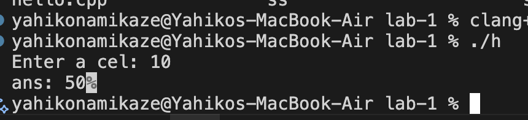
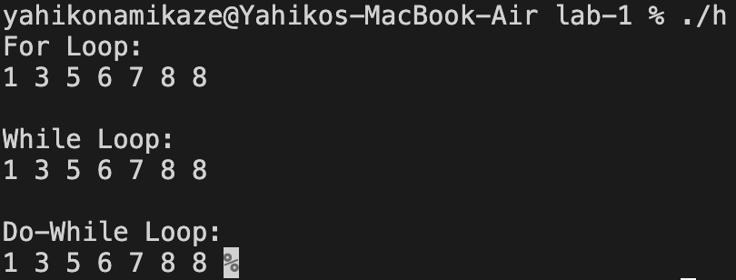
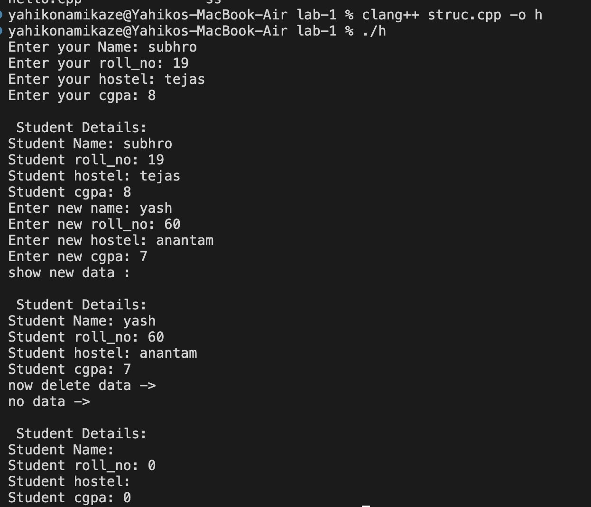
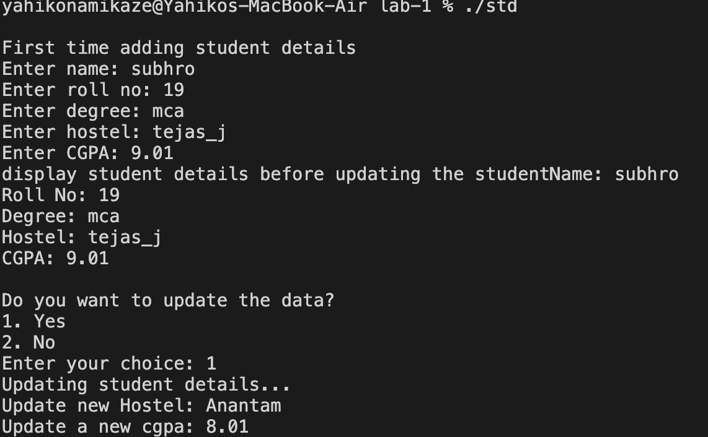
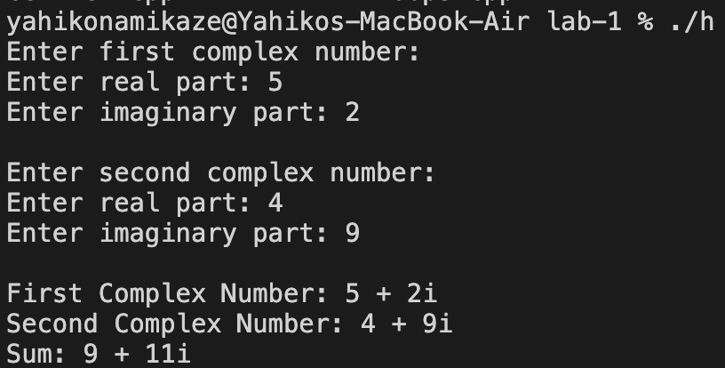
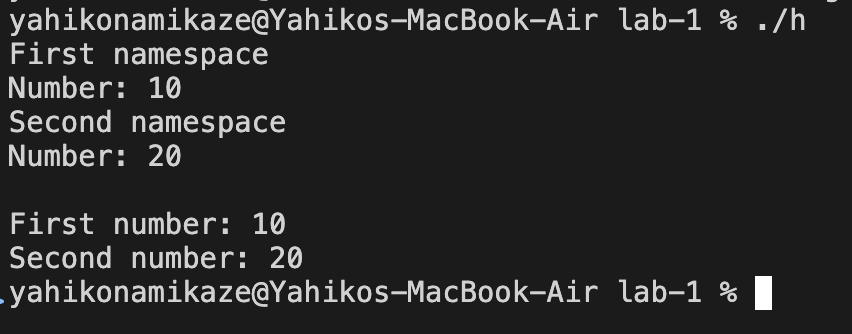

# OOP Lab Assignment 1

**Topics:** Basics of C++, Classes and Objects

---

## Q1. Hello World & Control Characters

**Question:**
Write a program to display "Hello World" on the console and implement the given control characters.

### Code

[`hello.cpp`](./hello.cpp)

### Output

---

## Q2. Celsius to Fahrenheit

**Question:**
Write a C++ program to take temperature in Celsius and display it in Fahrenheit.

### Code

[`q2.cpp`](./cel-fer.cpp)

### Output

---

## Q3. Loops

**Question:**
Demonstrate `for`, `while`, and `do-while` loops with their possible variations.

### Code

[`q3.cpp`](./loops.cpp)

### Output

---

## Q4. Student Structure

**Question:**
Create a structure containing student details with the required data members and member functions.

### Code

[`q4.cpp`](./struc.cpp)

### Output

---

## Q5. Private and Public Access

**Question:**
Differentiate between private and public access/scope. Perform Q4 using a class instead of a structure, with data members private and some member functions private and some public.

### Code

[`q5.cpp`](./student-class.cpp)

### Output

---

## Q6. Private Member Functions

**Question:**
Create a code snippet illustrating calling/accessing private member functions inside a public member function.

### Code

[`q6.cpp`](./Q6.cpp)

### Output

---

## Q7. Complex Class

**Question:**
Define a class named `Complex` with real and imaginary properties and the required member functions.

### Code

[`q7.cpp`](./Q7.cpp)

### Output

---

## Q8. Namespace

**Question:**
Implement namespace in a program to illustrate the use of same-name variables and functions in different sections/libraries of the code.

### Code

[`q8.cpp`](./Q8.cpp)

### Output

---
