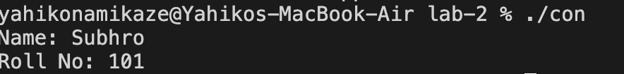
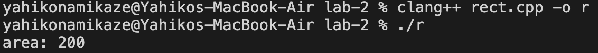
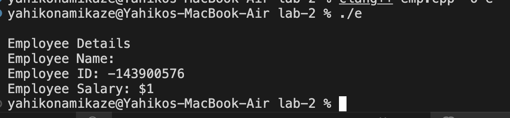
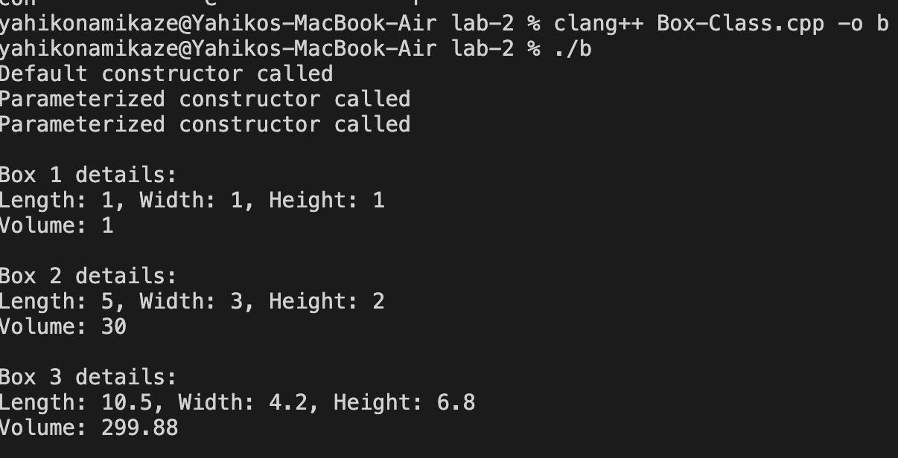
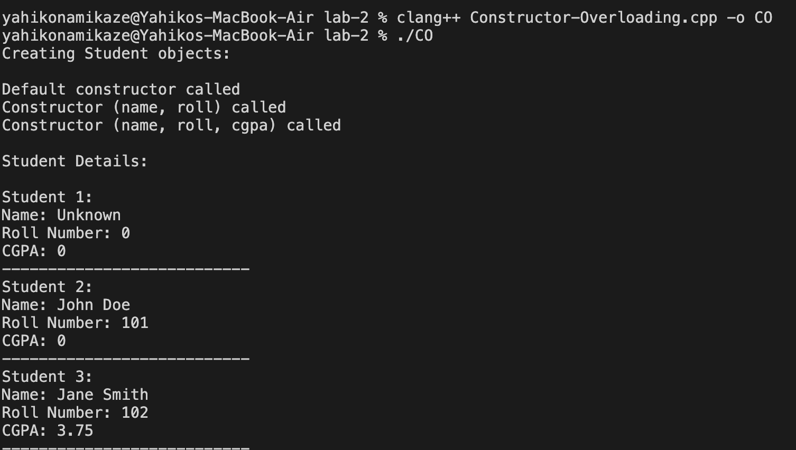
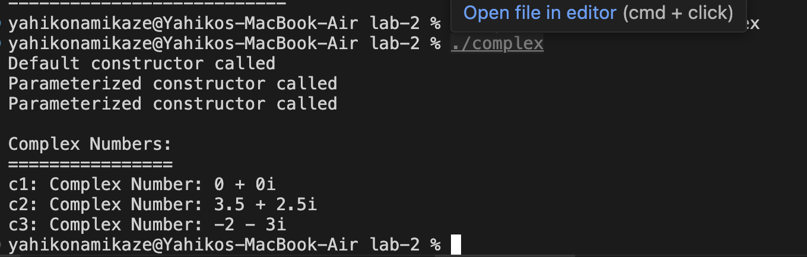
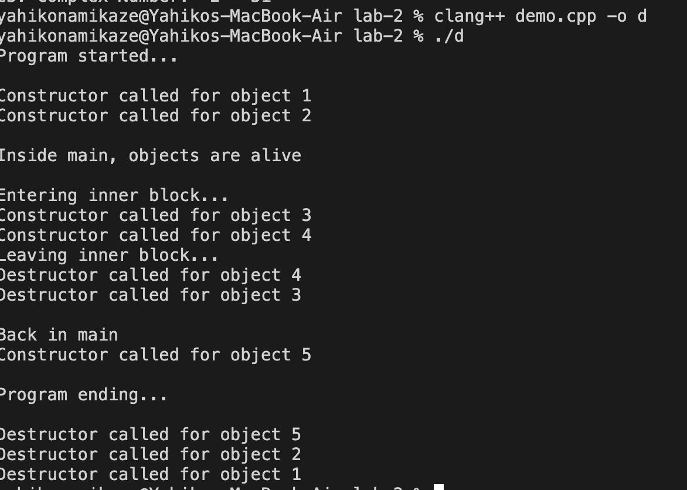
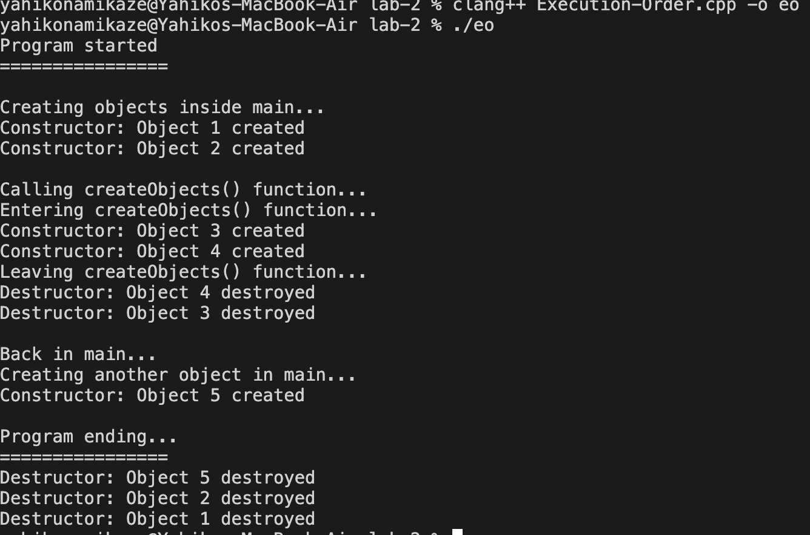

# Object Oriented Programming Lab Assignment - 2

## Topics: Constructors and Destructors

This assignment covers **constructors, parameterized constructors, constructor overloading, and destructors in C++**.

---

## Question 1 — Student Class using Default Constructor

### Problem Statement
Write a C++ program to create a class `Student` with data members `name` and `rollNo`. Use a **default constructor** to initialize these values and display the student details.

### Code
[`contructor.cpp`](./contructor.cpp)

### Output / Screenshot

> **Screenshot:** Add the output screenshot here.

---

## Question 2 — Rectangle using Parameterized Constructor

### Problem Statement
Create a class `Rectangle` having data members `length` and `breadth`. Use a **parameterized constructor** to initialize the values and display the area of the rectangle.

### Code
[`rect.cpp`](./rect.cpp)

### Output / Screenshot

> **Screenshot:** Add the output screenshot here.

---

## Question 3 — Employee Class using Parameterized Constructor

### Problem Statement
Write a C++ program to create a class `Employee` with data members `name`, `id`, and `salary`. Initialize the data members using a **parameterized constructor** and display the employee details.

### Code
[`emp.cpp`](./emp.cpp)

### Output / Screenshot

> **Screenshot:** Add the output screenshot here.

---

## Question 4 — Box Class with Default and Parameterized Constructors

### Problem Statement
Create a class `Box` with data members `length`, `width`, and `height`. Implement:

- A default constructor
- A parameterized constructor
- A function to calculate and display volume

### Code
[`Box-Class.cpp`](./Box-Class.cpp)

### Output / Screenshot

> **Screenshot:** Add the output screenshot here.

---

## Question 5 — Constructor Overloading

### Problem Statement
Write a program to demonstrate **constructor overloading** using a class `Student`. Create:

- A default constructor
- A constructor accepting `name` and `roll number`
- A constructor accepting `name`, `roll number`, and `CGPA`

Display the details of objects created using all three constructors.

### Code
[`Constructor-Overloading.cpp`](./Constructor-Overloading.cpp)

### Output / Screenshot

> **Screenshot:** Add the output screenshot here.

---

## Question 6 — Complex Class

### Problem Statement
Create a class `Complex` with real and imaginary data members. Implement:

- A default constructor
- A parameterized constructor
- A display function

### Code
[`complex.cpp`](./complex.cpp)

### Output / Screenshot

> **Screenshot:** Add the output screenshot here.

---

## Question 7 — Constructors and Destructors

### Problem Statement
Create a class `Demo` that displays a message when its constructor is called and another message when its destructor is called. Create multiple objects of the class and observe the order in which constructors and destructors execute.

### Code
[`demo.cpp`](./demo.cpp)

### Output / Screenshot

> **Screenshot:** Add the output screenshot here.

---

## Question 8 — Execution Order of Constructors and Destructors

### Problem Statement
Write a C++ program to demonstrate the **execution order of constructors and destructors** when objects are created inside `main()` and inside a separate function.

### Code
[`Execution-Order.cpp`](./Execution-Order.cpp)
### Output / Screenshot

> **Screenshot:** Add the output screenshot here.

---