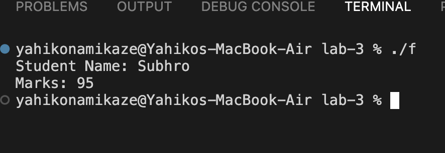
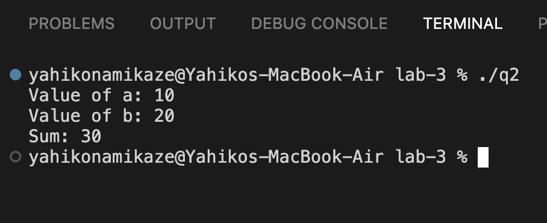
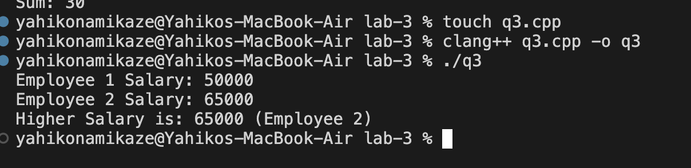
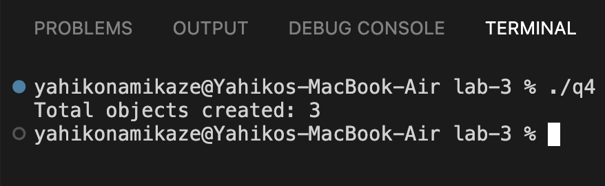
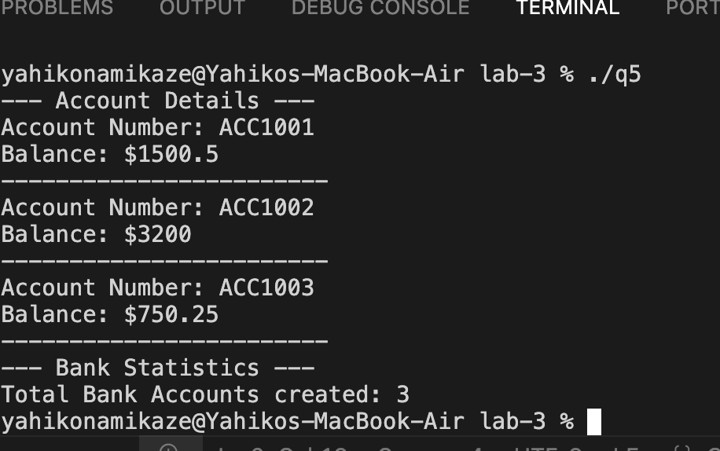

# Object Oriented Programming Lab Assignment - 3
## Friend Function & Static Member Programs

## 1. Student — Friend Function

**File:** [`friend.cpp`](./friend.cpp)

### Output

## 2. Number — Friend Function

**File:** [`q2.cpp`](./q2.cpp)

### Output

## 3. Employee — Friend Function

**File:** [`q3.cpp`](./q3.cpp)

### Output

## 4. Student — Static Data Member

**File:** [`q4.cpp`](./q4.cpp)

### Output

## 5. BankAccount — Friend & Static Member Functions

**File:** [`q5.cpp`](./q5.cpp)

### Output

