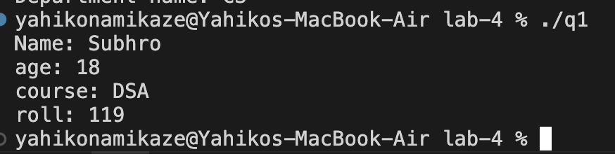
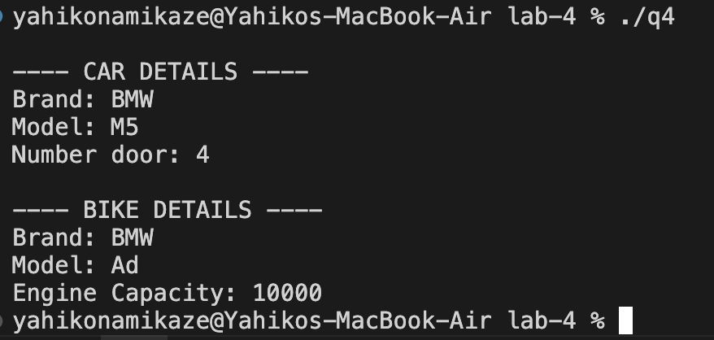
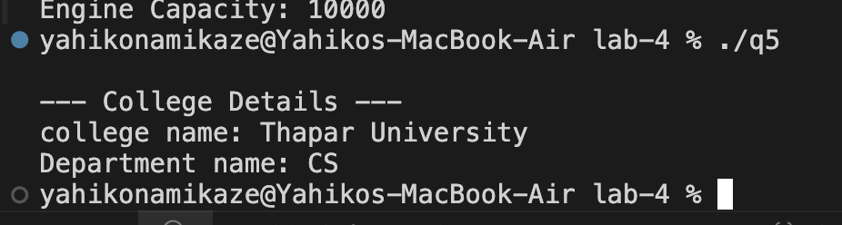

# Object Oriented Programming Lab Assignment - 4
## Inhertance

## 1. Sigle Inheritance

**File:** [`q1.cpp`](./q1.cpp)

### Output

## 2. Multi-level Inheritance

**File:** [`q2.cpp`](./q2.cpp)

### Output

## 3. Multiple Inheitance

**File:** [`q3.cpp`](./q3.cpp)

### Output

## 4. Hierarchial Inheritance

**File:** [`q4.cpp`](./q4.cpp)

### Output

## 5. Q5

**File:** [`q5.cpp`](./q5.cpp)

### Output

